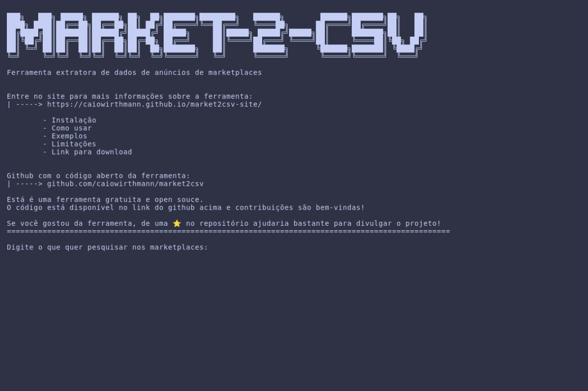
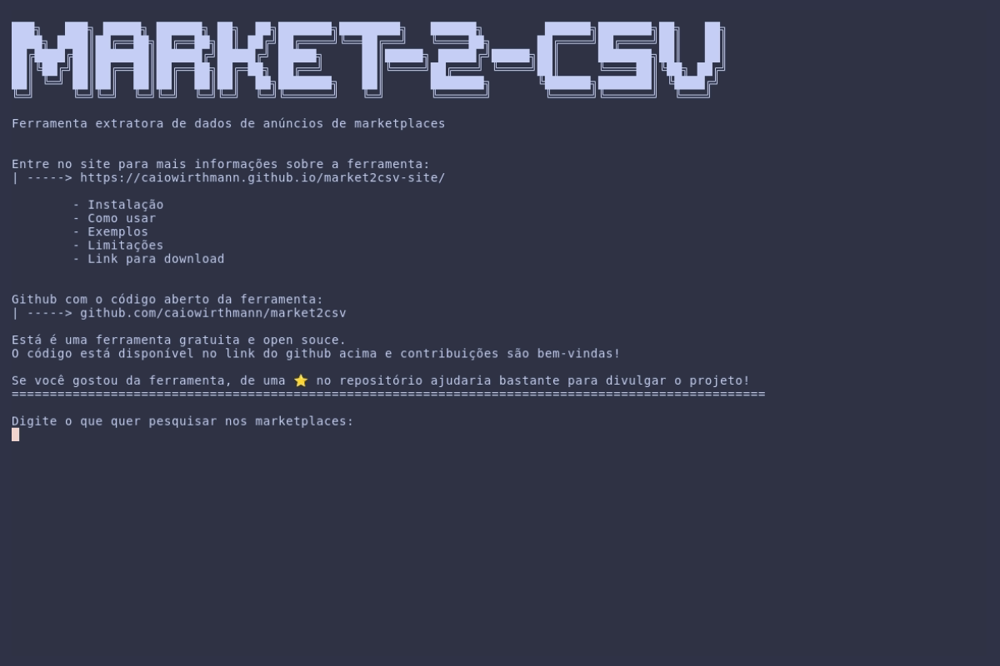
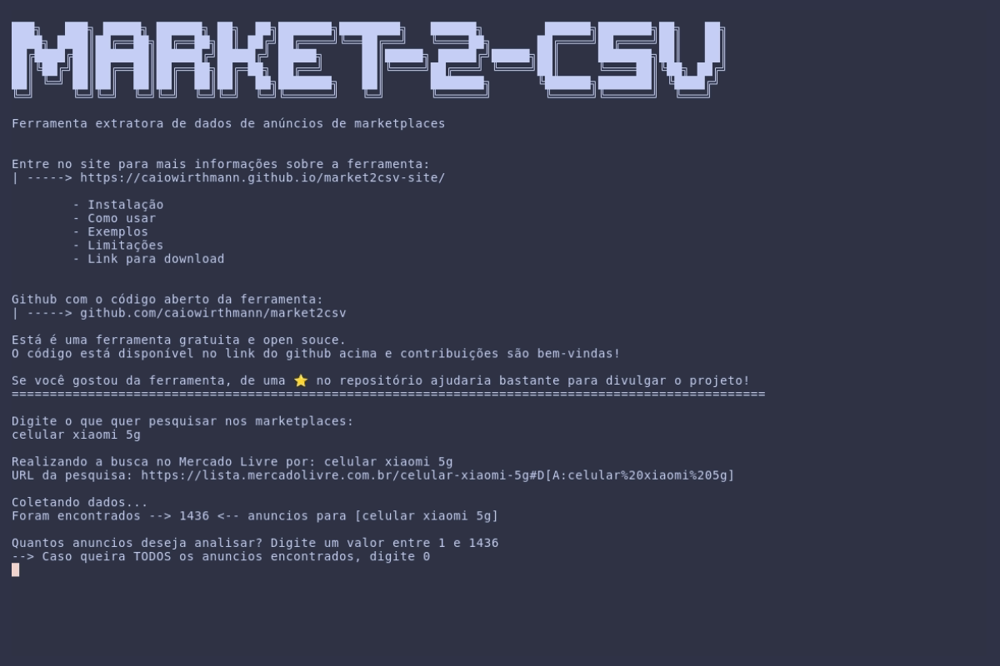
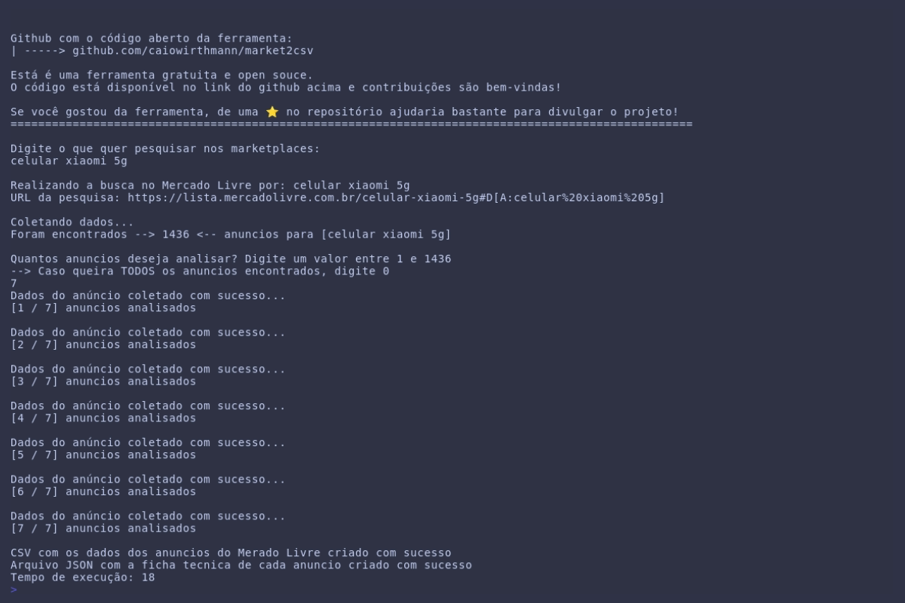

# market2csv

🎯 Market2csv é uma ferramenta Open Souce gratuíta para extração de dados de anúncios de diversos marketplaces e exportação para um `.csv` com base em um termo de busca

Fácil de usar e simples, não precisa de login na conta do marketplace, pagamento ou qualquer outra informação

Compatível com sistemas Windows quanto Unix

---

## 🛍️ O que o `market2csv` faz?

- Aceita um termo de busca diretamente no terminal
- Permite que o usuário defina quantos anuncios serão analisados
- Coleta dados detalhados dos anúncios:
    - Titulo
    - Condição {Novo, usado, recondicionado}
    - Preço {Preço Base, Preço com desconto}
    - Quantidade de Vendas
    - Estoque
    - Anuncio é patrocinado?
    - Anuncio está no Full?
    - Nota de avaliação
    - Quantidade de reviews
    - Link do anuncio
    - Nome do vendedor
    - Link da loja do vendedor
    - Tipo de loja do vendedor {Padrão, Eshop, Loja Oficial}
    - Descrição
    - Ficha técnica completa (exportado para um arquivo separado)
  
- Exporta todos os dados para um arquivo `.csv` com o nome da pesquisa e data para fácil acesso e indexação
- Ficha técnica é exportada para um arquivo `.json`
- Gera um log de qualquer erro que aconteça durante a extração para facilitar a correção de bugs
---
<br>

## 🚀 Como usar
Demo do funcionamento da ferramenta




Ao abrir a ferramenta, será solicitado que você digite o que quer pesquisar nos marketplaces para realizar a extração dos dados:



Após a ferramenta identificar a quantidade de anúncios, será solicitado quantos anúncios você quer analisar:



A ferramenta irá mostrar um texto informativo do progresso da extração dos dados dos anúncio, e caso aconteça algum problema na extração de algum dado, será mostrado também uma mensagem informativa.
E ao final, uma mensagem informando sobre a criação do arquivo `.csv` com os dados coletados e com o arquivo `.json` da ficha técnica completa de cada anúncio:



---
<br>

### Pré-requisitos

> Caso queira rodar a ferramenta diretamente pelo código fonte

- Go `+1.24.0` instalado ([Caso não tenha siga as instruções aqui](https://golang.org/doc/install))
- Git instalado ([Caso não tenha siga as intruções aqui](https://git-scm.com/))

### Clone o repositório

```bash
git clone https://github.com/caiowirthmann/market2csv.git
cd market2csv
```

### Executando a ferramenta

```bash
go run main.go
```

1. Ao executar a ferramenta, será pedido que digite o que quer pesquisar nos marketplaces: ex (`smartphone xiaomi`)
2. A quantidade de anúncios que serão analisados e exportados
3. Durante a extração dos dados, caso aconteça algum erro, será mostrada uma mensagem informando sobre o erro
4. Ao terminar a extração, serão exibidas duas mensagens:
    1. Criação do arquivo `.csv` com os dados do dos anúncios
    2. Criação do arquivo `.json` com a ficha técnica de cada anúncio


>O arquivo CSV e JSON gerado será salvo automaticamente em uma pasta chamada `extracoes`, criada no mesmo local do executável — isso funciona tanto em Windows quanto em sistemas Unix.

<br>
---

## 🧾 Exemplo do arquivo gerado (.csv)

> Mercado Livre

|titulo|condição|preco_base|preco_atual|quantidade_vendas|estoque|patrocinado|tem_full|nota|quantidade_reviews|link_anuncio|vendedor|vendedor_link|tipo_loja|descricao|
|------|--------|-------|-------|------|-------|-----|-----|----|-----|------------|--------|-------------|---------|---------|
|Produto 1|novo|65.99|60.99|50|4|não|sim|4.8|75|link_anuncio_marketplace|vendedor x|link_vendedor_marketplace|Loja oficial|descricao do produto completa|


```json
[
 {
  "titulo": "Xiaomi Redmi 13 Dual Sim 256-gb 8-gb Ram Global",
  "link": "https://produto.mercadolivre.com.br/MLB-5349435042-xiaomi-redmi-13-dual-sim-256-gb-8-gb-ram-global-_JM?searchVariation=187511295831#is_advertising=true\u0026searchVariation=187511295831\u0026position=1\u0026search_layout=stack\u0026type=pad\u0026tracking_id=03312ff9-b89b-4f6e-945b-a855779b7a86\u0026is_advertising=true\u0026ad_domain=VQCATCORE_LST\u0026ad_position=1\u0026ad_click_id=OTYzNWFlYmEtOGZkMi00ZGRmLThjMjYtN2I2YjlmMjViOGFh",
  "ficha_tecnica": {
   "Abertura do diafragma da câmera frontal": "f 2.2",
   "Abertura do diafragma da câmera traseira": "f 1.69/f 2.4/f 2.4/f 2.4",
   "Acessórios incluídos": "1 cabo USB",
   "Altura fechado": "0 mm",
   "Altura x Largura x Profundidade": "16.26 cm x 7.48 cm x 8.96 mm",
   "Ano de lançamento": "2021",
   "Autonomia da batería em standby": "0 h",
   "Autonomia de conversação": "0 h",
   "Brilho máximo da tela": "1.120 cd/m²",
   "Brilho máximo da tela secundária": "0 cd/m²",
   "Camada original de personalização do sistema operacional": "MIUI 12",
   "Capacidade da bateria": "4,78 Ah",
   "Capacidade máxima do cartão de memória": "0 KB",
   "Características principais das câmeras": "Foto HDR, Modo beleza IA, Modo profissional, Panorama mode, Super Night View 2.0",
   "Classificação IP": "IP53",
   "Com Bluetooth": "Sim",
   "Com GPS": "Sim",
   "Com IMEI": "Sim",
   "Com NFC": "Sim",
   "Com Wi-Fi": "Sim",
   "Com acelerômetro": "Sim",
   "Com barômetro": "Sim",
   "Com bateria removível": "Não",
   "Com bússola": "Sim",
   "Com carregamento rápido": "Sim",
   "Com carregamento sem fio": "Sim",
   "Com conector USB": "Sim",
   "Com conector jack 3.5 mm": "Não",
   "Com câmera": "Sim",
   "Com flash na câmara frontal": "Não",
   "Com giroscópio": "Sim",
   "Com leitor de impressão digital": "Sim",
   "Com radio": "Não",
   "Com ranhura para cartão de memória": "Não",
   "Com reconhecimento de mão": "Sim",
   "Com reconhecimento de íris": "Não",
   "Com reconhecimento facial": "Sim",
   "Com sensor de proximidade": "Sim",
   "Com sintonizador de TV": "Não",
   "Com teclado QWERTY físico": "Não",
   "Com tela dobrável": "Não",
   "Com tela tátil": "Sim",
   "Duração do produto": "0 meses",
   "Fabricante": "Xiaomi Communications Co., Ltd.",
   "Inclui lápis": "Não",
   "Largura fechada": "0 mm",
   "Linha": "Mi",
   "Marca": "Xiaomi",
   "Memória RAM": "8 GB",
   "Memória interna": "256 GB",
   "Modelo": "Xiaomi 13 lite",
   "Modelo alfanumérico": "24049RN28L",
   "Modelo de GPU": "Adreno 650",
   "Modelo detalhado": "8 GB",
   "Modelo do processador": "Snapdragon 870",
   "Modelos de CPU": "1x3.2 GHz Kryo 585, 3x2.42 GHz Kryo-585, 4x1.8 GHz Kryo-585",
   "Mês de lançamento": "Março",
   "Nome do sistema operacional": "Android",
   "Número de homologação da Anatel": "217582209185",
   "Operadora": "Desbloqueado",
   "Período de parte de reposição ou serviço técnico": "0 meses",
   "Peso": "208 g",
   "Pixels por polegada da tela": "386 dpi",
   "Pixels por polegada da tela dobrada": "0 ppi",
   "Pixels por polegada da tela dobrada secundária": "0 ppi",
   "Pixels por polegada da tela secundária": "0 ppi",
   "Profundidade cerrado": "0 mm",
   "Proporção da tela": "19.5:9",
   "Quantidade de câmeras frontais": "1",
   "Quantidade de câmeras traseiras": "4",
   "Quantidade de núcleos do processador": "8",
   "Quantidade de ranhuras para cartão SIM": "2",
   "Rede móvel": "5G",
   "Resolução da câmera frontal principal": "20 Mpx",
   "Resolução da câmera grande-angular": "8 Mpx",
   "Resolução da câmera traseira principal": "108 Mpx",
   "Resolução da tela": "1080 px x 2340 px",
   "Resolução das câmeras frontais": "32 Mpx, 8 Mpx",
   "Resolução das câmeras traseiras": "108 Mpx/13 Mpx/2 Mpx/2 Mpx",
   "Resolução de vídeo da câmera frontal": "1920 px x 1080 px",
   "Resolução de vídeo da câmera traseira": "7680 px x 4320 px",
   "Tamanho da tela": "6,67 \"",
   "Tamanho da tela dobrada": "0 \"",
   "Tamanho da tela dobrada secundária": "0 \"",
   "Tamanho da tela secundária": "0 \"",
   "Tamanhos de cartão SIM compatíveis": "Nano-SIM",
   "Taxa de atualização da tela": "90 Hz",
   "Taxa de atualização da tela secundária": "0 Hz",
   "Tecnologia da tela": "AMOLED",
   "Tipo de bateria": "Polímero de lítio",
   "Tipo de conector de carregamento": "USB-C",
   "Tipo de resolução da tela": "Full HD+",
   "Tipos de cartão de memória": "Micro-SD",
   "Tipos de câmeras traseiras": "Macro, Regular",
   "Velocidade do GPU": "670 MHz",
   "Velocidade do processador": "3,2 GHz",
   "Versão original do sistema operacional": "11",
   "Zoom digital": "0x",
   "Zoom híbrido": "0x",
   "Zoom óptico": "0x",
   "É Dual SIM": "Sim",
   "É celular para jogos": "Sim",
   "É celular robusto": "Sim",
   "É resistente a salpicos": "Sim",
   "É resistente ao pó": "Sim",
   "É resistente à água": "Não",
   "É à prova d'água": "Não",
   "Última camada compatível de personalização do sistema operacional": "MIUI 14",
   "Última versão compatível do sistema operacional": "13"
  }
 }
]
```
<br>
---


## ℹ️ Notas sobre limitações e comportamento da ferramenta no **Mercado Livre**

Algumas informações exibidas nos anúncios do Mercado Livre são disponibilizadas de forma limitada ou não-exatas (principalmente por questões de privacidade implementadas pelo Mercado Livre) Abaixo seguem as explicações de cada campo em que isso ocorre:

### 📊 Quantidade de vendas

O número de vendas exibido nos anúncios do Mercado Livre segue um padrão de **faixas** após 5 unidades vendidas. Então:

- Anuncios com até 5 unidades, o número exato é mostrado.
- Após isso (5+ vendas), o site exibe apenas pelo **PRIMEIRO VALOR** de um **INTERVALO APROXIMADO**

```code
5 a 9 - Exibido como +5 Vendidos
10 a 24 - Exibido como +10 Vendidos
25 a 49 - Exibido como +25 Vendidos
50 a 99 - Exibido como +50 Vendidos
100 a 499 - Exibido como +100 Vendidos
500 a 999 - Exibido como +500 Vendidos

A partir de 1000 unidades vendidas começa a aparece "mil" de forma literal ao invés de "000"

1000 a 4.999 - Exibido como +1000 Vendidos
5mil a 9.999 - Exibido como +5mil Vendidos
10mil a 49.999 - Exibido como +10mil Vendidos
50mil a 99.999 - Exibido como +50mil Vendidos
+100mil - Exibido como +100mil Vendidos
```
### 📦 Estoque

Mesmo caso da quantidade de vendas, o numero **EXATO** é disponibilizado somente até **5 unidades**, após isso é disponibilizado em **faixas**

> caso o anúncio não tenha estoque (o unidades), o anúncio fica pausado e só é possível acessá-lo se tiver o link dele. Ele não aparece na busca

> 1 unidade - Último disponível!

```code
5 a 9 - +5 disponíveis
10 a 24 - +10 disponíveis
25 a 49 - +25 disponíveis
50 a ... - +50 disponíveis
```

*Apesar do mercado livre não disponibilizar uma forma de acessar a quantidade de estoque disponível no anúncio, existem meios de descobrir o número exato. É necessário que o vendedor não tenha definido um limite de unidades por compra no anúncio (na opção de quantidade aparece um menu com a opção `mais de x unidades`) e que você tenha tempo de sobra. Basta clicar na opção e ir trocando para um valor que não aparece a mensagem de "sem estoque" quando você digitar o valor. Tentativa e erro, bateção de lata*

**A FERRAMENTA NÃO FAZ ISSO**

### 🚚 Frete / Full

Frete *por enquanto* não é uma opção disponibilizada na ferramenta:

- Calculo do frete é multifatorial:
    - Categoria do anúncio
    - Reputação do vendedor
    - Valor de venda do anúncio
    - Dimensões do produto
    - Forma de entrega
    - Região despacho x Região entrega
    > Esse valor é calculado e mostrado no anúncio quando se está **logado** na sua conta do mercado livre, e selecionadA a forma de entrega <mark>Mercado envios, Full, Mercado Envios Flex, Frete a combinar com o vendedor</mark> e o endereço de entrega (é possível ter mais de um endereço de entrega, mas na conta você seleciona um "padrão" que será usado para esses calculos e mostrado primeiro)

A coluna de `Full` da ferramenta mostra apenas se o anúncio tem Mercado Envios Full ou não. O valor em sí segue a mesma questão citada acima

## 🛠️ Roadmap de funcionalidades e melhorias

🔴 **Alta prioridade** || 🟡 **Média prioridade** || ⚪ **Baixa prioridade**


- [ ] 🔴 Incluir funcionalidade para Shopee
- [ ] 🔴 Incluir funcionalidade para Amazon
- [ ] 🔴 Incluir funcionalidade para Shein
- [ ] Configuração para permitir personalização do arquivo de exportação:
    - [ ] ⚪ Incluir/Não incluir campo no `.csv`
    - [ ] ⚪ Ordem das colunas
    - [ ] 🟡 Configuração de quais campos são incluidos no arquivo da ficha técnica para identificação do anúncio (por padrão, são incluidos título e link)
    - [ ] 🟡 Pasta de exportação (nome e local)
- [ ] Novas opções de exportação:
    - [ ] ⚪ Exportar dados do anúncio para planilhas:
        - [ ] Excel: `.xls .xlsx`
        - [ ] LibreOffice/OpenOffice: `.ods`
---